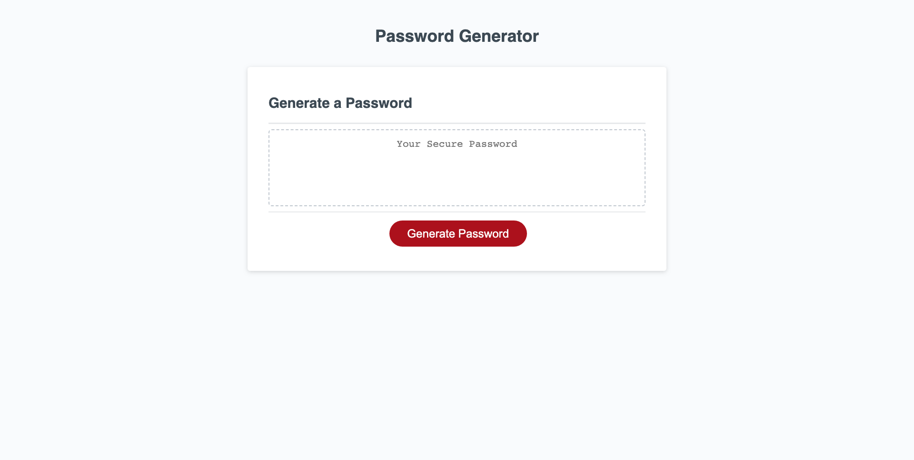

## Name
Challenge 03 for the JavaScript module of the Coding Bootcamp

## Description
Random Password Generator that allows the user to choose between 8 - 128 characters in length and also which character sets (Uppercase, Lowercase, Numeric and Special).

## Visuals

## Usage
Open your browser and visit the Direct URL that has been provided below. Once on the webpage, generate a password using the desired options via the prompts that pop-up on the page.

Direct URL: https://elitehuskie.github.io/module-03-challenge/

## License
Using standard MIT license